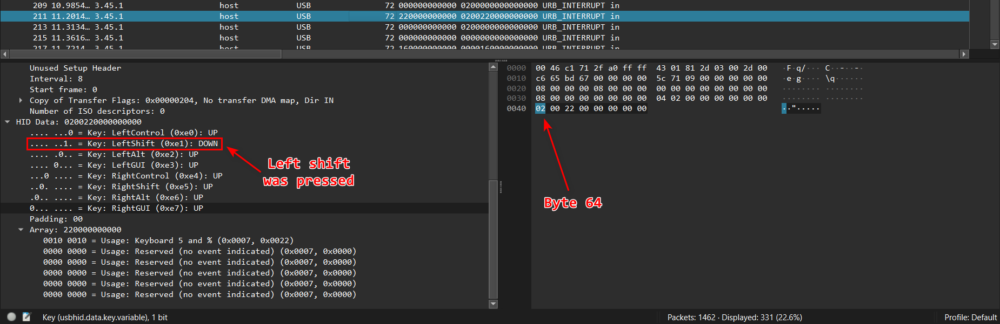
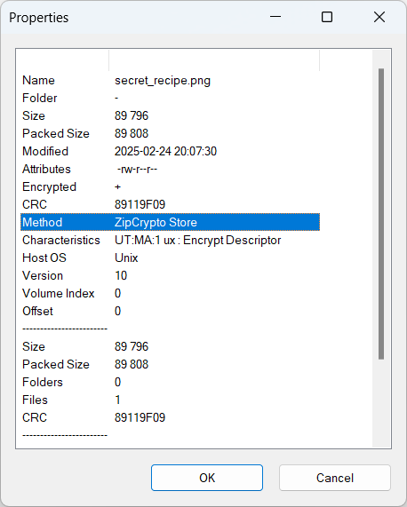
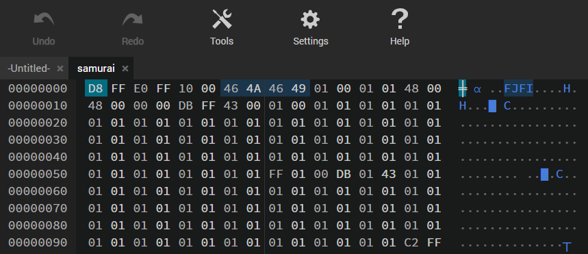
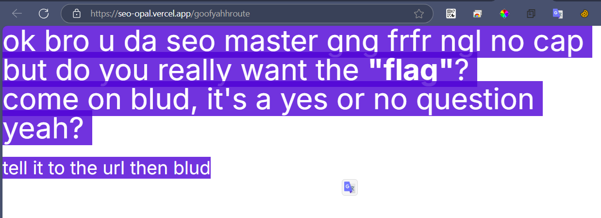

+++
date = '2025-08-08T10:30:41+07:00'
draft = false
title = 'ApoorvCTF 2025: Challenges & Writeups'
categories = ['Writeups', 'Security']
image = 'cover.jpg'
summary = 'My write-up for some challenges from ApoorvCTF 2025, covering Web and Forensics'
tags = ['web', 'forensics', 'zip cracking', 'bytes reversing', 'pcap analyze']
+++

## Ramen lockdown (Forensic)

what do all these words even mean?

The challenge provided a Wireshark log file `log.pcapng` with 2 text files named `flag.txt` and `synoonyms.txt`

Opening the file, we could see mainly packets with the information "URB INTERRUPT" which is an IP packet and a USB endpoint is like an IP port.  
Perhaps hidden under this log file is a message someone entered from the keyboard

### Solution

Apply filter `frame.len == 72` to filter out packets which isn't contain HID data
Parse each filtered packets, follow by these rules

64th byte: Left shift key down / up (pressed or not)
66th byte: Usage key

You can see what key pressed in Wireshark (HID Data > Array)



After parsing, I got a script

```
nvim flag.txt
:%s/0/10101/g
:%s/1/10011/g
:%s/[01]/\=system("awk 'NR % 2 ==".(submatch(0) == "0" ? "0" : "1")."' synoonyms.txt | shuf -n1")/g
```

By using ChatGPT - a really helpful AI, we got a Python script to restore `flag.txt` before the last line ran

```
with open("synoonyms.txt", "r", encoding="utf-8") as f:
    lines = [line.strip() for line in f.read().splitlines()]

even_words = set(lines[1::2])
odd_words = set(lines[0::2])

with open("flag.txt", "r", encoding="utf-8") as f:
    words = f.read().split()

binary_string = "".join("0" if word in even_words else "1" for word in words)

with open("recovered_binary.txt", "w", encoding="utf-8") as f:
    f.write(binary_string)

print("Done! Saved as recovered_binary.txt")
```

Continue using `neovim`, I replaced every `10011` to `1` and every `10101` to `0`

`$ nvim recovered_binary.txt`

and in `neovim`  
```
:%s/10101/0/g
:%s/10011/1/g
```

Open the file `recovered_binary.txt`, copy the binary string inside and [convert to ASCII](https://www.duplichecker.com/binary-to-ascii.php)

Flaggg, finally got the flag!!1

### Flag: `apoorvctf{ne0v1m_1s_b3tt3r}`

## Ramen lockdown (Forensic)
A criminal mastermind named larry stole Chef Tataka ultimate ramen recipe and yeeted it into a password-protected zip file. Inside? A sacred file with the secret to flavor nirvana. Crack the zip, save the slurp. No pressure. 🍜💀

The challenge provided a compressed file `recipe.zip`

### Analysis
As the challenge description said, we have to crack the `recipe.zip` file. This file requires password for extracting files contained inside it

Normally, compressed files use AES-256 encryption. Therefore, it is very difficult to brute-force passwords.
However, we can directly view the file inside by using 7-Zip. There's a file named `secret_recipe.png`

### Solution

Still using 7-Zip, we know the encryption method is not AES-256! It's ZipCrypto


Nice, we gonna use [bkcrack](https://github.com/kimci86/bkcrack) to extract the `secret_recipe.png` image

To break ZipCrypto, `bkcrack` requires 12 bytes of known plaintext. PNG files start with the following hex header: `89 50 4E 47 0D 0A 1A 0A 00 00 00 0D 49 48 44 52`

I used this command (finished in ~3 minutes)

`bkcrack -C recipe.zip -c secret_recipe.png -x 0 89504E470D0A1A0A0000000D49484452`

And got the key

`7cfefd6a 4aedd214 970c7187`

Now, we can decrypt the archive and save it as an unencrypted version

`bkcrack -C recipe.zip -k 7cfefd6a 4aedd214 970c7187 -D recipe_decrypted.zip`

Opened the image inside `recipe_decrypted.zip`, and I got ...

### Flag: `apoorvctf{w0rst_r4m3n_3v3r_ong}`

## Samurai's Code (Forensic)

Unveil the lost code of the Samurai and unlock the mystery hidden within.

The challenge provided a compressed file with an `sam.png` image inside

### Analysis

Open the image, I cannot see any information relate to flag, it's just a normal image with samurai.  
Maybe we have to find out any information hidden inside the image

### Solution

By using command `$ strings sam.png`, I got a very suspicious text block at the end.

```
++++++++++[>+>+++>+++++++>++++++++++<<<<-]>>>>++++.++++++++++++..----.+++.<------------.-----------..>---------------.++++++++++++++.---------.+++++++++++++.-----------------.<-.>++.++++++++..--------.+++++.-------.<.>--.++++++++++++.--.<+.>-------.+++.+++.-------.<.>-.<.++.+++++++++++++++++++++++++.+++++++++++++.>+++++++++++++.<+++++++++++++.----------------------------------.++++++++.>+++++++++.-------------------.<+++++++.>+.<-----.+++++++++.------------.<+++++++++++++++.>>++++++++++++++++.<+++.++++++++.>-.<--------.---------.++++++++++++++++++++.>.<++.>--------------.<<+++++.>.>-----.+++++++.<<++.>--.<++.---------.++.>>+++++++++++.-------------.----.++++++++++++++++++.<<++++++++++++++++.>>--.--.---.<<--.>>+++.-----------.-------.+++++++++++++++++.---------.+++++.-------.
```

This is [Brainfuck](https://md5decrypt.net/en/Brainfuck-translator/) language. By decrypting it, I got a download link, got a new file named `samurai` from downloading

Great, got a new file. However, `exiftool` return me `Error: Unknown file type`

Viewed the hex. I saw a section `FJFI` in the header, this could be a `JFIF` file and we have to edit hexadecimal contents of the file given



Usually, the header of `JFIF` file should be `FF D8 FF E0 00 10 4A 46 49 46`. But it seems like every 2 bytes in the file are swapped.

I wrote a simple Python script to swap every 2 bytes back to their original state.

```
with open("samurai", "rb") as file:
    BUF = 2  # Reverse every 2 bytes
    bytes_rev = b""
    bytes_read = bytearray(file.read(BUF))

    while bytes_read:
        bytes_rev += bytes_read[::-1]
        bytes_read = file.read(BUF)

    with open("swap.jfif", "wb") as newfile:
        newfile.write(bytes_rev)
```

The newly received image file clearly shows what we need to find, which is the flag.

### Flag: `apoorvctf{ByT3s_OUT_OF_ORd3R}`

## SEO CEO (Web)
They're optimizing SEO to show this garbage?!
[https://seo-opal.vercel.app](https://seo-opal.vercel.app/)

### Analysis
The description hint a keyword is SEO (search engine optimization). We gonna check out how the SEO works

### Solution
Normally, the SEO search for `sitemap.xml` file.
So that, I tried to get to
https://seo-opal.vercel.app/sitemap.xml

Retrieved the ``sitemap.xml`` content include this block, which is so suspicious route that is ``/goofyahhroute``

```
    <url>
		<loc>https://www.thiswebsite.com/goofyahhroute</loc>
	    <lastmod>2025-02-26</lastmod>
	    <changefreq>never</changefreq>
	    <priority>0.0</priority>
    </url>
```

Open browser, navigate to https://seo-opal.vercel.app/goofyahhroute


By selecting all contents or View source, I could view all the hidden contents
Based on what the route told me, I added a parameter `?flag=yes`

### Flag: `apoorvctf{s30_1snT_0pt1onaL}`