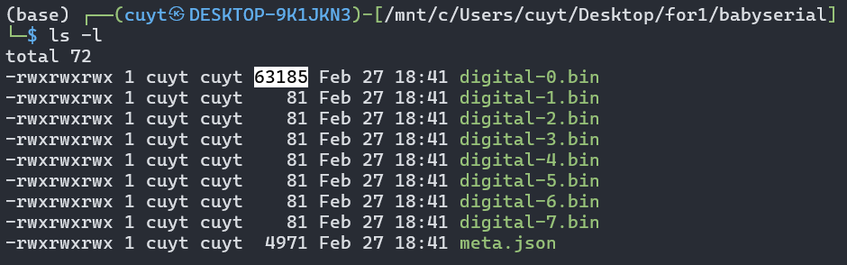
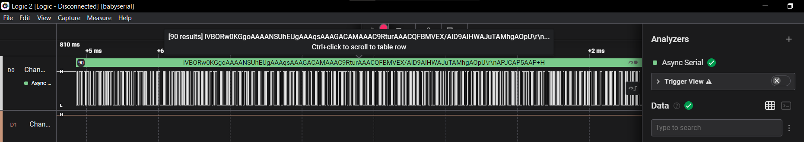
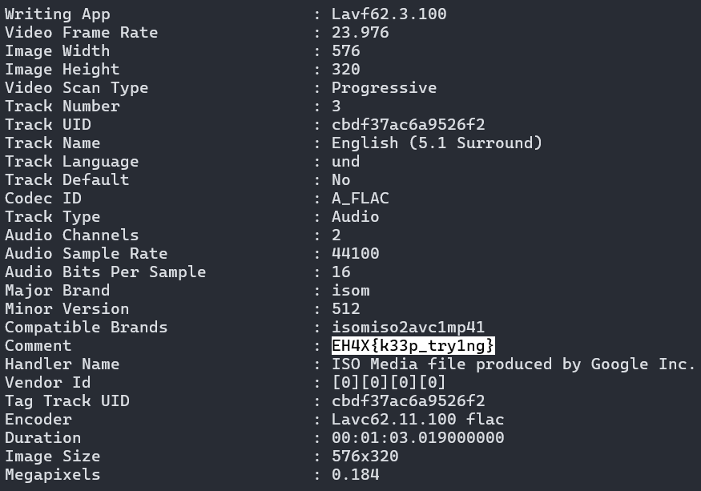
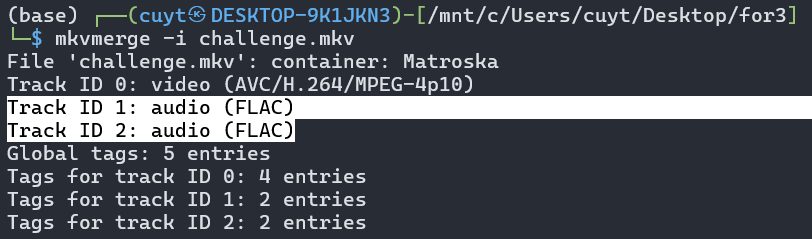
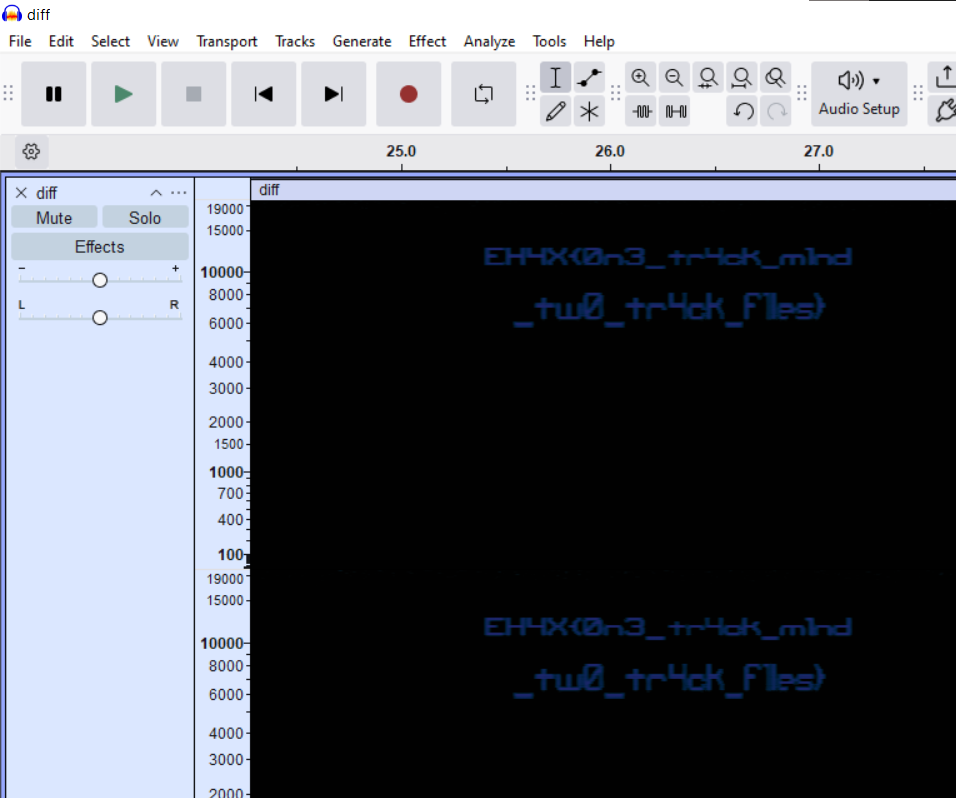

+++
date = '2026-03-02T13:58:22+07:00'
draft = false
title = 'EHAX CTF 2026: Challenges & Writeups'
categories = ['Writeups', 'Security']
image = 'cover.jpg'
summary = 'A collection of write-ups for EHAX CTF 2026: approaches, dead ends, and the final paths that led to the flag'
tags = ['logic analyzer saleae', 'forensics', 'misc', 'audio steganography', 'image steganography', 'pcap analyze']
+++

## Forensic challenges

### Challenge: baby serial

#### Description

```
Joe was trying to sniff the data over a serial communication. Was he successful?

author: Anonimbus

(include babyserial.sal)
```

#### My very first solution (unintended I guess)

As above, the challenge gave me the **`babyserial.sal`** file. At the first time, I realize I can open it using WinRAR to extracting the files `digital-0.bin` to `digital-7.bin` below. As you guy can see, the `digital-0.bin` size has ~63KB should contain data while others only have ~81B (mostly null, just headers ...)



The `meta.json` file describes the capture configuration (eg: sampling rate, device, trigger, UI state, channel mapping, etc.).

After searching, I know that Saleae does not store every single 0/1 sample for the whole capture (because at 1 MHz × ~3.3 seconds that would be huge). Instead, it stores the signal as runs between edges, like:

- stay at this logic level for X samples
- then the signal flips (0-1 or 1-0),
- stay for Y samples,       
- flip again,
- etc.

Those numbers X, Y, … are stored using ULEB128 / varint encoding (each number can take 1 byte or multiple bytes depending on its size).

So the very first step is:

1. read the binary file
2. decode the varints
3. get a list like: [run1, run2, run3, ...] where each value is a duration measured in samples

Once I have the run-length list, I look at a histogram / common values and see repeated durations and realize

- 8–9 samples ~ 1 bit
- 16–17 ~ 2 bits
- 25–26 ~ 3 bits

Now I rebuild bitstream, write a Python script for trying multiple framings

```python
import base64, re, zlib, gzip, io, zipfile, binascii

flag_re=re.compile(rb"EH4X\{[^}]{1,200}\}")
d=open("recovered/120000_7E2_norm.bin","rb").read()

def hunt(buf, tag):
    m=flag_re.search(buf)
    if m:
        print("[+] FLAG via",tag,":",m.group(0).decode(errors="ignore"))
        raise SystemExit

def try_decompress(buf, tag):
    hunt(buf, tag)
    if buf.startswith(b"\x1f\x8b\x08"):
        try: hunt(gzip.decompress(buf), tag+"->gzip")
        except: pass
    if len(buf)>2 and buf[0]==0x78:
        for w in (15, -15):
            try: hunt(zlib.decompress(buf, wbits=w), tag+f"->zlib({w})")
            except: pass
    if buf.startswith(b"PK\x03\x04"):
        try:
            zf=zipfile.ZipFile(io.BytesIO(buf))
            for n in zf.namelist():
                try: hunt(zf.read(n), tag+f"->zip:{n}")
                except: pass
        except: pass

# 1) raw
try_decompress(d,"raw")

# 2) strip to printable
p=bytes([b for b in d if b in b"\n\r\t" or 32<=b<=126])
try_decompress(p,"printable")

# 3) try std base64/base85 on each long printable line
lines=[x for x in p.splitlines() if len(x)>=20]
for i,ln in enumerate(lines[:500]):
    ln=ln.strip()
    # base64
    for fn,name in [
        (base64.b64decode,"b64"),
        (base64.urlsafe_b64decode,"b64url"),
        (base64.b85decode,"b85"),
        (base64.a85decode,"a85"),
    ]:
        try:
            out=fn(ln + b"===")  # tolerate padding
            try_decompress(out,f"line{i}:{name}")
        except: pass

print("[-] No flag found by broad sweep.")
```

I finally got `out.png` reveals the flag


#### Intended solution

Thanks to [1r0nx's writeup](https://github.com/1r0nx/CTFs-Write-up-s/tree/main/2026-EHAX-CTF)

I open the `babyserial.sal` file using [Saleae Logic 2](https://saleae.com/logic)

Next, add an "Async Serial" analyzer for Channel 0. I realize this must be a data file



Now, export those data to a `.csv` file and use 1r0nx's Python script to read the `.csv` file and put those data together.

```python
import csv
import base64

INPUT = "bin_ch0/digital.csv"
BAUD = 115200
BIT_TIME = 1 / BAUD
edges = []
with open(INPUT) as f:
    r = csv.reader(f)
    next(r)
    for row in r:
        t = float(row[0])
        v = int(row[1])
        edges.append((t, v))

bits = []
for i in range(len(edges)-1):
    t, v = edges[i]
    t2, _ = edges[i+1]
    duration = t2 - t
    count = round(duration / BIT_TIME)
    bits.extend([v] * count)

# UART decode
bytes_out = []
i = 0
while i < len(bits) - 10:
    if bits[i] == 0:  # start bit
        data = bits[i+1:i+9]
        value = 0
        for b in range(8):
            value |= data[b] << b
        bytes_out.append(value)
        i += 10
    else:
        i += 1

data = bytes(bytes_out)
print("Recovered bytes:", len(data))

# sauver brut
with open("serial.bin", "wb") as f:
    f.write(data)
try:
    txt = data.decode()
    print("ASCII preview:")
    print(txt[:200])
    if "iVBOR" in txt:
        print("Base64 PNG détecté")
        b64 = txt.split("iVBOR",1)[1]
        b64 = "iVBOR" + b64
        img = base64.b64decode(b64)
        with open("flag.png", "wb") as f:
            f.write(img)
        print("Image sauvée → flag.png")

except:
    pass
```

### Challenge: let-the-penguin-live

#### Description

```
In a colony of many, one penguin's path is an anomaly. Silence the crowd to hear the individual.

author - mahekfr

(include challenge.mkv)
```

#### Solution

First, I used `exiftool` to view the metadata and saw the comment. The author wants to encourage us so he wrote out "keep trying" - but that's wasn't  the flag



Next, using the `mkvmerge` tool to see the information about this file. Saw? Here we have 2 audio tracks for this file


As the author hint - "silence the crowd to hear the individual", I extracted out 2 tracks.

```
mkvextract tracks challenge.mkv 1:a1.flac 2:a2.flac
```

Both of them are 1 min 3 second length. And "to hear the individual", I used `ffmpeg` to get the different between two tracks to end, save to `diff.flac`.

```
ffmpeg -y -i a1.flac -i a2.flac -filter_complex "amix=inputs=2:weights='1 -1'" -ss 00:00:00.0 -to 00:01:03.0 dif
f.flac
```

Finally, using Audacity to view the spectrogram and I got flag




{}

### Challenge: painter

### power leak

### Quantum Message

### Jpeg Soul

## 2. Web challenges

## 3. Misc challenges

{}