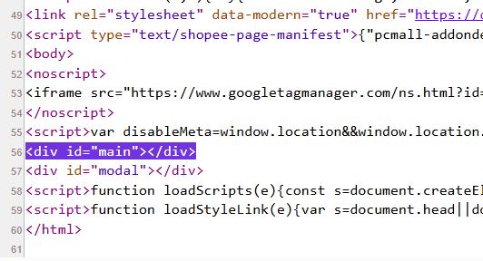
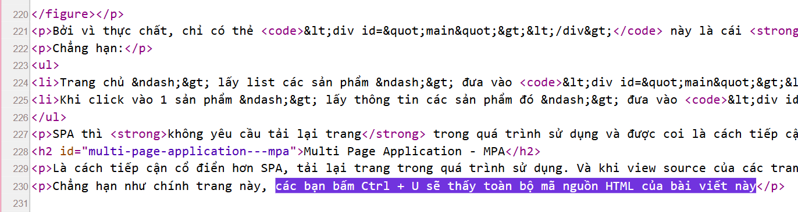

+++
date = '2026-07-03T13:25:33+07:00'
draft = false
title = '[ReactJS] - Single Page Application'
series = ['MERN Stack Ký Sự']
categories = ['Web Development']
tag = ['web', 'react', 'js', 'reactjs', 'spa', 'mpa', 'javascript', 'routing', 'mern']
series_order = 2
image = 'cover.png'
+++

## Single Page Application - SPA

Là kiểu ứng dụng web chỉ tải một **tài liệu HTML chính** ở lần truy cập **đầu tiên**. Khi người dùng **chuyển giữa các màn hình**, trình duyệt **không tải lại** toàn bộ trang mà dùng JavaScript sẽ lấy dữ liệu cần thiết và cập nhật giao diện ngay trên trang hiện tại.

Nói thì có vẻ khó hiểu, nhưng hãy xem ví dụ này. Khi bạn view source (Ctrl + U) trang shopee.vn, thì bạn sẽ chỉ thấy có vỏn vẹn vài dòng HTML thôi

Bởi vì thực chất, chỉ có thẻ `

` này là cái **khung chung cho mọi trang**, khi user chuyển hướng đến một trang khác thì sẽ dùng JavaScript để xử lí và đưa các thành phần của trang đó vào trong cái khung này

Ví dụ đơn giản như

- Ở trang chủ, ứng dụng gọi API lấy danh sách sản phẩm rồi hiển thị lên giao diện.
- Khi mở chi tiết sản phẩm, ứng dụng gọi API lấy thông tin sản phẩm và cập nhật phần nội dung cần thay đổi.

Nhờ vậy, quá trình chuyển giữa các màn hình thường **không cần full page reload**, nên trải nghiệm sử dụng có thể mượt hơn.

## Multi Page Application - MPA

**Multi Page Application (MPA)** là kiểu web **truyền thống**, trong đó mỗi lần chuyển sang một trang khác, trình duyệt thường gửi **request mới** lên server và nhận về một tài liệu **HTML mới**.

Ví dụ với một blog được render sẵn bằng server hoặc static site generator (bài viết này), khi bấm `Ctrl + U`, bạn có thể thấy phần lớn nội dung HTML của bài viết ngay trong source:

## Khác biệt của SPA và MPA

| Tiêu chí | SPA | MPA |
|---|---|---|
| Cách tải trang | Tải một HTML chính, sau đó cập nhật giao diện bằng JavaScript | Mỗi route thường trả về một HTML mới |
| Chuyển trang | Thường không reload toàn bộ trang | Thường có full page reload |
| Lần tải đầu | Có thể nặng hơn vì phải tải bundle JavaScript | Thường hiển thị nội dung ban đầu nhanh hơn nếu HTML đã render sẵn |
| Các lần chuyển sau | Thường nhanh và mượt hơn | Phụ thuộc vào server, cache và lượng tài nguyên cần tải lại |
| SEO | Cần SSR, SSG, prerendering hoặc cấu hình tốt nếu render chủ yếu ở client | Thường thuận lợi hơn vì HTML có sẵn nội dung |
| JavaScript | Phụ thuộc nhiều vào JavaScript | Có thể hoạt động tốt cả khi dùng ít JavaScript |
| Phù hợp với | Dashboard, admin panel, web app nhiều tương tác | Blog, tin tức, tài liệu, landing page, website thiên về nội dung |

## Tại sao lại cần SPA?

Nếu như không xét đến vấn đề tốc độ thì mình khá thắc mắc tại sao lại cần đến SPA.

Theo góc nhìn của mình khi đọc tài liệu trên lớp thì quá trình nó sẽ như sau

### **Web truyền thống sử dụng MPA**

Rất ổn định, nhưng khi chuyển trang thì trình duyệt sẽ xoá sạch môi trường JavaScript hiện tại đi.

Môi trường JavaScript thì có thể hiểu là toàn bộ những dữ liệu được lấy/tạo ra bằng JavaScript. Ví dụ

- Ở trang A, lấy được số liệu giá vàng qua 1 hàm `fetch()`
- Khi sang trang B, mất toàn bộ số liệu đó (do trình duyệt xoá)
- Khi quay lại trang A, trình duyệt lại phải tải lại dữ liệu giá vàng qua `fetch()`

Để giải quyết vấn đề này, trình duyệt còn có cache, `localStorage`, `sessionStorage`, cookie, server-side session. Tuy nhiên, với các ứng dụng **nhiều tương tác** như dashboard, chat, trình chỉnh sửa nội dung hoặc admin panel, việc giữ **trải nghiệm liền mạch** là rất quan trọng.

SPA giải quyết bài toán này bằng cách **giữ lại cùng một document** trong trình duyệt. Thay vì để browser tải trang mới, ứng dụng dùng JavaScript để:

- gọi API lấy dữ liệu mới;
- cập nhật phần giao diện cần thay đổi;
- giữ lại state đang dùng trong app;
- điều hướng giữa các màn hình mà không cần full reload.

### Vấn đề routing trong SPA

Nếu chỉ thay đổi giao diện bằng JavaScript mà **không cập nhật URL**, người dùng sẽ gặp nhiều vấn đề:

- không bookmark được màn hình hiện tại;
- không copy link để chia sẻ đúng vị trí đang xem;
- nút Back/Forward của trình duyệt không phản ánh đúng các màn hình trong app;
- refresh hoặc mở trực tiếp một đường dẫn con có thể không hiển thị đúng nội dung.

Vì vậy, SPA hiện đại thường dùng **client-side routing**. Tức là Router sẽ đồng bộ giao diện với URL bằng một trong hai cách phổ biến:

- **Hash routing**: dùng phần sau dấu `#`, ví dụ `/index.html#/products/123`.
- **History API routing**: dùng URL “đẹp” như `/products/123`, kết hợp với `pushState`, `replaceState` và sự kiện `popstate`.

Cách này giúp SPA vừa giữ được môi trường JavaScript hiện tại, vừa hỗ trợ URL, Back/Forward, bookmark và chia sẻ link tốt hơn.

Trong đó thì ReactJS là một trong những thư viện phổ biến tạo ra SPA